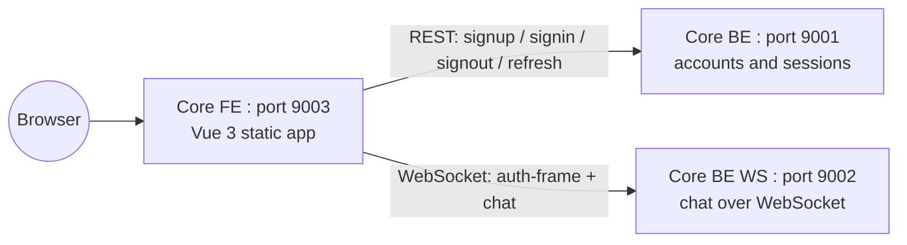
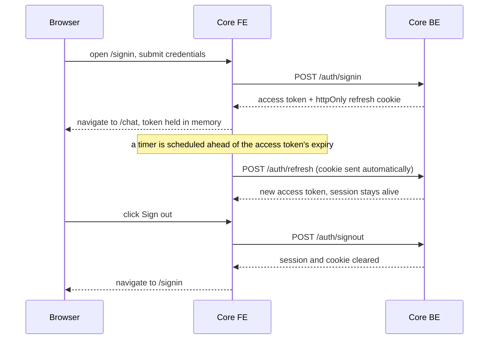

# High-Level Design: Core FE

 

## System context

Core FE is one of three services in the chat-bot product:

Core FE is a static single-page app, it holds no secrets and runs no server-side logic of its own beyond serving files. Every REST and WebSocket call it makes goes directly from the browser to Core BE or Core BE WS, Core FE's own container never sits in that path.

 

## Responsibilities

- Let a visitor create an account, sign in, or sign out, against Core BE's REST API.
- Keep a signed-in session alive across the access token's short lifetime with a silent refresh, using the httpOnly cookie Core BE issued.
- Open a WebSocket connection to Core BE WS, send the auth frame, and drive the rest of the chat protocol: conversation list, create, rename, delete, and streamed message send.
- Render conversation history, including replaying it after selecting a conversation again on reconnect or after a page reload.
- Stay usable on both a phone-sized and a desktop-sized viewport.
- Serve a static `/health` file baked at build time, for both local debugging and deployment verification.

 

## What it does not do

- It does not issue or validate JWTs itself, that is Core BE.
- It does not persist the access token anywhere durable, a full page reload always re-establishes the session through the refresh cookie, never through client-side storage.
- It does not run any server-side code beyond the static file server, all the actual account and chat logic lives in Core BE and Core BE WS.
- It does not retry a failed chat completion itself, Core BE WS already reports that as an error frame on the same connection, Core FE just shows it.

 

## Session flow: sign in, silent refresh, sign out

 

## Dependencies

- Core BE REST API: signup, signin, signout, refresh.
- Core BE WS WebSocket API: auth frame, conversation CRUD, streamed chat.
- No datastore, no secrets, and no build-time dependency on either other service being reachable, only a runtime one.
